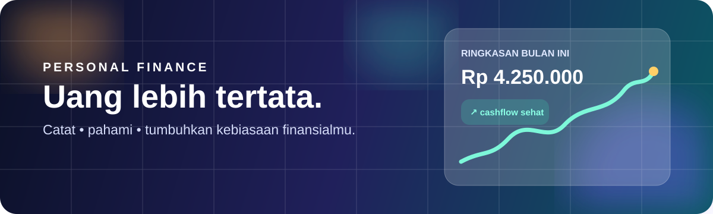

# Finance

<p align="center"></p>

<p align="center"><strong>Aplikasi pencatatan keuangan pribadi yang cepat, aman, dan nyaman dipakai dari ponsel.</strong><br />Dibangun dengan FastAPI, SQLite, Jinja2, dan JavaScript tanpa framework frontend berat.</p>

<p align="center"><a href="#mulai-cepat">Mulai cepat</a> · <a href="#fitur-utama">Fitur</a> · <a href="#keamanan">Keamanan</a> · <a href="docs/CLONE_AND_SETUP.md">Panduan lengkap</a></p>

> Banner di atas adalah SVG ringan dengan animasi warna. Tidak memakai data akun, token, atau layanan pihak ketiga.

## Kenapa Finance?

Finance membantu mencatat arus uang sehari-hari, melihat kebiasaan belanja, dan memantau target finansial dari satu tempat. Semua nominal disimpan sebagai integer Rupiah agar perhitungan konsisten dan tidak terkena masalah pembulatan floating-point.

| Cepat mulai | Aman secara default | Siap berkembang |
| --- | --- | --- |
| Setup lokal cukup satu perintah | Session cookie, CSRF, hashing password, dan scope data per pengguna | REST API, PWA, ekspor Excel, OCR receipt, dan Docker |

## Mulai cepat

Prasyarat: Git dan Python 3.11 atau lebih baru.

```powershell
git clone <URL_REPOSITORY_ANDA> finance
cd finance
python bootstrap.py
```

Command terakhir membuat virtual environment, memasang seluruh dependency, dan menyalin `.env.example` ke `.env` bila belum ada. Tidak ada secret yang otomatis dibuat atau dikirim ke mana pun.

```powershell
.\.venv\Scripts\python.exe -m uvicorn app.main:app --reload --host 0.0.0.0 --port 8080
```

Buka `http://localhost:8080`. Untuk Linux/macOS, gunakan `.venv/bin/python` sebagai pengganti path Windows. Panduan production, Docker, OCR/AI, backup, scheduler, dan troubleshooting tersedia di [Clone & Setup](docs/CLONE_AND_SETUP.md).

## Fitur utama

- **Dashboard yang jelas** — saldo, cashflow, saving rate, net worth, tren enam bulan, dan transaksi terbaru.
- **Transaksi & transfer** — income, expense, transfer antar-akun, filter, pencarian, tag, dan lampiran receipt.
- **Akun lengkap** — cash, bank, e-wallet, kartu kredit, pay later, investasi, aset, serta liabilitas.
- **Perencanaan** — budget kategori, tagihan berkala, recurring transaction, debt tracker, dan savings goal.
- **Receipt intelligence** — upload receipt, deduplikasi SHA-256, OCR lokal, atau AI vision opsional; hasil selalu direview sebelum menjadi transaksi.
- **Laporan & ekspor** — laporan periode, kategori, tren, snapshot net worth, CSV, dan Excel.
- **Nyaman di perangkat apa pun** — desain mobile-first, dark/light mode, PWA, bahasa Indonesia, dan dukungan reduced motion.
- **Admin & kesehatan sistem** — manajemen pengguna, audit log, password-reset request, serta halaman status service.

## Arsitektur

```text
Browser (Jinja2 + HTML/CSS/JS)
             │
             ▼
FastAPI / Starlette ──► Services ──► SQLAlchemy ──► SQLite
       │                    │
       ├── Auth + session   ├── Finance & reports
       ├── UI routes        ├── OCR / receipt AI
       └── REST API v1      └── Schedulers / seeders
```

| Area | Teknologi |
| --- | --- |
| Backend | Python 3.11+, FastAPI, Starlette, SQLAlchemy |
| UI | Jinja2, HTML5, CSS3, vanilla JavaScript |
| Database | SQLite dengan migrasi idempoten |
| Testing | pytest dan httpx |
| Deploy | Docker Compose atau service Python biasa |

## Struktur proyek

```text
app/                 aplikasi FastAPI: routes, API, service, model, template, static
tests/               test unit, integrasi, keamanan, dan regresi
docs/                dokumentasi produk, OCR, audit, dan panduan setup
data/                database, receipt, serta backup lokal (tidak masuk Git)
bootstrap.py         setup dependency satu perintah
docker-compose.yml   runtime container
```

## Keamanan

- Password disimpan menggunakan PBKDF2-HMAC-SHA256 dengan salt acak.
- Session memakai cookie `HttpOnly` dan `SameSite=Lax`; token sesi disimpan sebagai hash.
- Form HTML dilindungi CSRF dan query data dipagari `user_id` untuk mencegah IDOR.
- Pada production, aplikasi menolak start jika secret default masih dipakai dan memaksa debug nonaktif.
- Database, upload, log, virtual environment, serta `.env` diabaikan Git.

**Jangan pernah commit `.env`, password, API key, token, database, atau file receipt pribadi.** Simpan rahasia hanya melalui environment runtime/deployment. Nama variabel dan cara konfigurasi aman dijelaskan di [panduan setup](docs/CLONE_AND_SETUP.md); dokumen ini sengaja tidak mencantumkan nilai kredensial.

## Menjalankan dengan Docker

```bash
cp .env.example .env
# Tinjau nilai production pada .env tanpa memasukkan file tersebut ke Git.
docker compose up -d --build
```

Data persisten disimpan pada `./data`. Untuk memantau aplikasi:

```bash
docker compose logs -f finance
```

## Testing

Dependency test sudah termasuk dalam bootstrap.

```powershell
.\.venv\Scripts\python.exe -m pytest -q
```

Test mencakup autentikasi, accounting invariants, API, migrasi, ownership, UI, OCR, scheduler, serta kasus batas nominal uang.

## Dokumentasi

- [Panduan Clone & Setup](docs/CLONE_AND_SETUP.md)
- [Product Requirement Document](docs/PRD.md)
- [Audit aplikasi](docs/AUDIT.md)
- [Konfigurasi Ollama production](docs/OLLAMA_PROD.md)
- [Panduan Receipt AI](docs/RECEIPT_AI_ID.md)

## Lisensi

Private — hak cipta milik pembuat.
